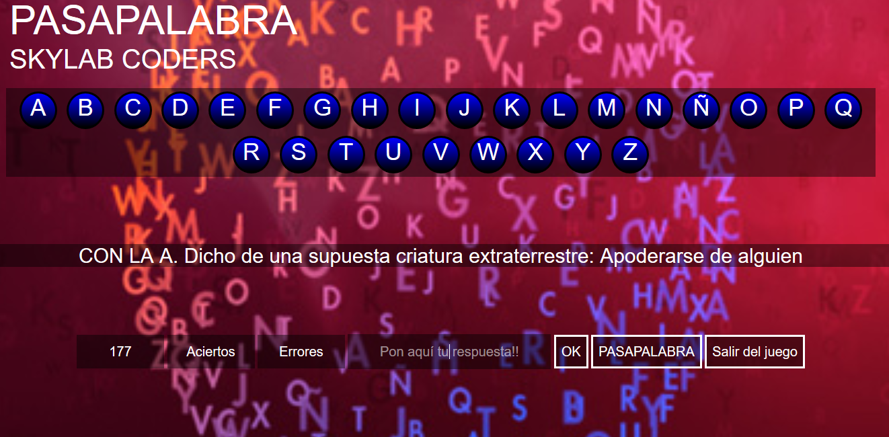

#PASAPALABRA HTML + CSS + JAVASCRIPT

Este es el proyecto final del precourse de Skylab Coders, basado en el programa de televisión Pasapalabra.

Para este proyecto se ha usado:

* HTML
* CSS
* JAVASCRIPT

;
;