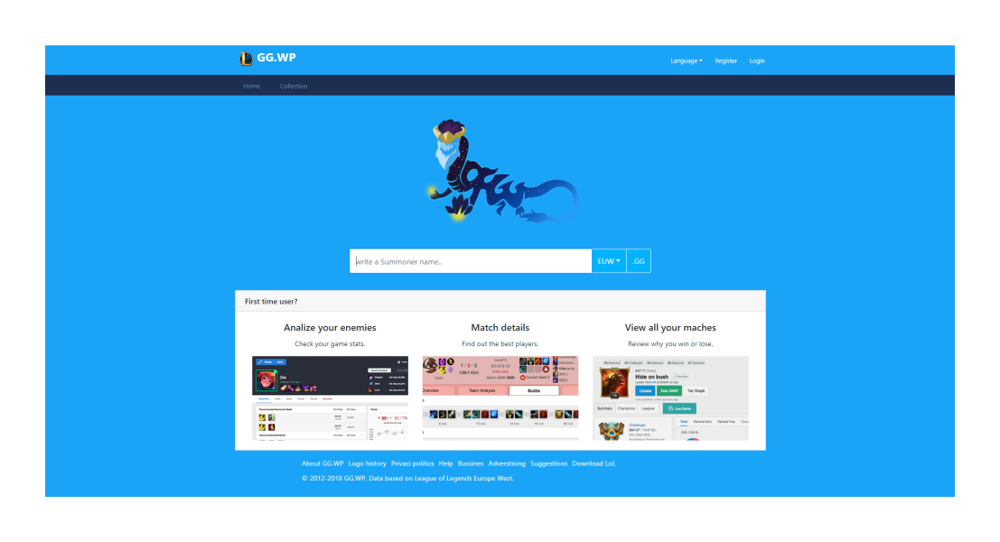
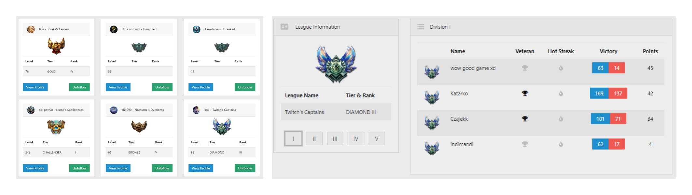
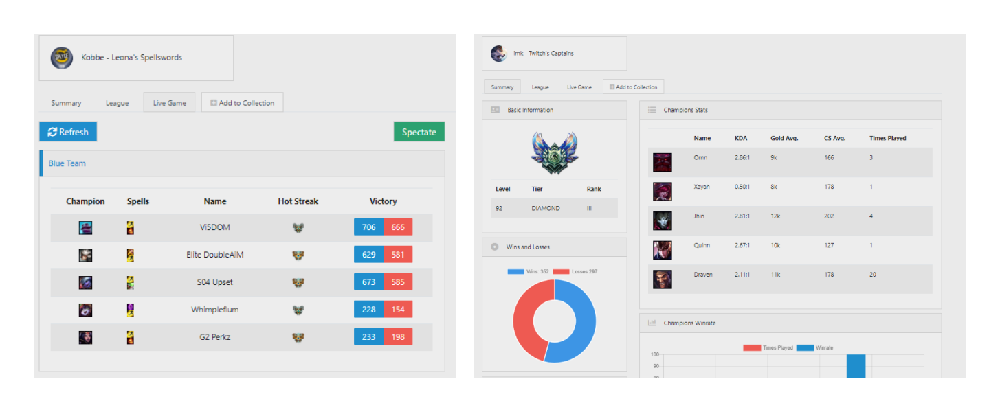
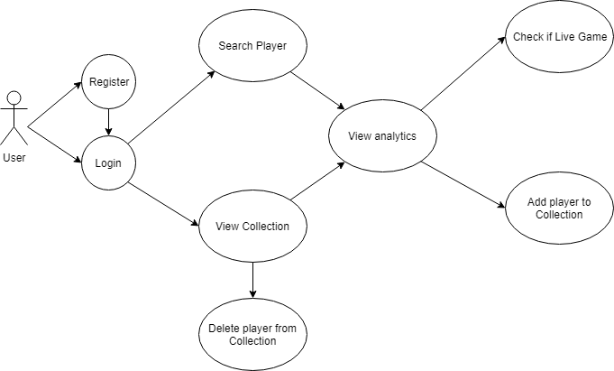
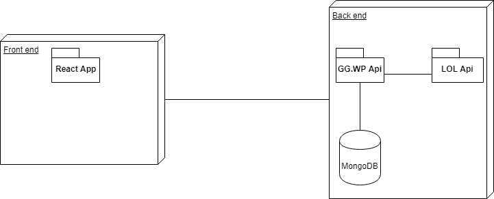
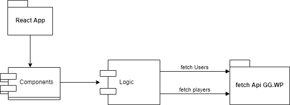
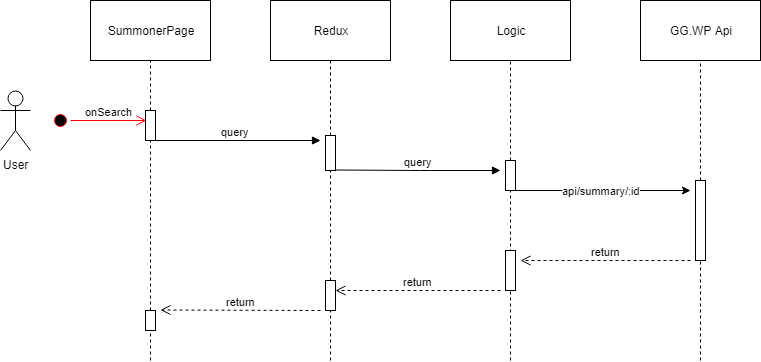
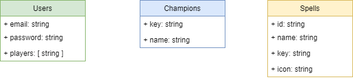

# GG.WP App

## Intro

This application is thought of as an aid in planning to improve your skills as a player in League of Legends game, allowing a user to search their or other players profiles, watch countless data analytics displayed in a friendly way with graphics and tables, review and save profiles to a private collection .

## Functional description

The "GG.WP App" allows the user to access the vast realm of players profiles and analytics of the League of Legends game, according to [unrankedsmurfs](https://www.unrankedsmurfs.com/blog/players-2017) league reach the top in 2016 with 100.000.000 millions players. We treat that players data and show stats and profiles. Once registered and logged in the user may search through the players database, the serach term must be the player nickname. If the search is successful, the user may find out a summary of player gameplay details, and if the player is currently in a league or in a live game it will be shown the proper information to informa the user of those events.

The user can select a player profile  as "favourites" and save them to their collection for later reference, so that when the user login they may know which players states are the first they want to see.

### Screen Shots

### Use Cases

## Technical description

The application is a web application that is able to run either with a browser environment, mobile phone or tablet. It consists of a ReactJS frontend and Redux to handle the react-states. The react-logic connects to a single api (GG.WP API) that handles:

- user registration and login, as well as storing profile data
- search, retrive and filter the information of the players

There is a second api, the oficial League of Legends server that retrives raw players information.

The application is written in Javascript and takes advantage of ES6 and ESNext Javascript features.

User data is persistent across page reloads, as users data is stored in the user's SessionStorage --email and token.  

### Blocks

### Components

### Sequences

- search

### Data model

 