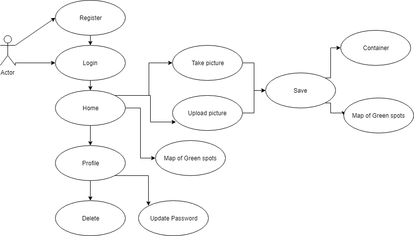
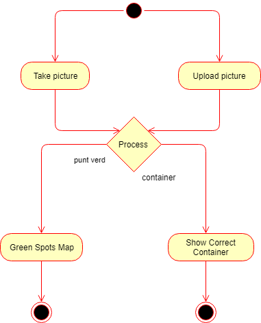
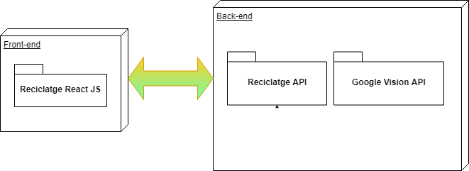
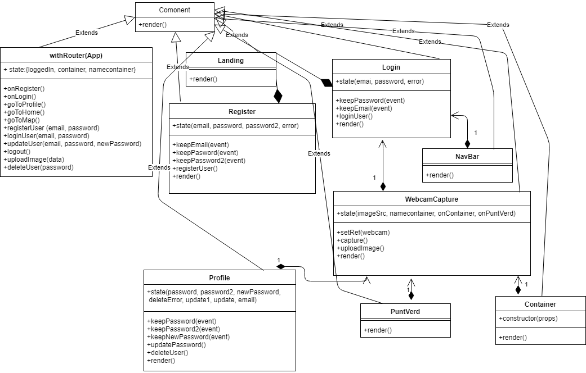
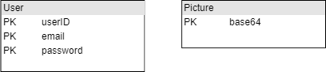

# Reciclatge

## Introduction

This applications lets you to take or upload a picture and return the Green Spot or the container that goes.

It vas developed as a full-stack project for the Skylab Coders bootcamp (Barcelona, 2018).
The objective was to apply the following technologies in a real life application:

- Javascript (ES6)
- React
- React Router
- Node 
- Sass
- BEM
- CSS
- Mongo
- Mongoose

## Functional description

### Use cases diagram

As a user you can regiser and login. Then, you can take a picture with your camera or upload a picture from your files. 
You can process the picture and then the application return the container or the green spot where goes the object.
You can also update your password and delete your acount.

### Activity diagram

We have two principal activites, upload a picutre o take a picture. After save the picture, it returns two options, show a map of green spots or show the correct container.

## Technical Description

### Block diagram

The front end of the application was built using React. The back end is connected with 2 APIs in order to manage the users and process the images(Google Vision)

### Component diagram

My application has some react components, tue business logic and two APIs with her own bussines logic. The two APIs are Reciclatge API and Google Vision API.

### Class Diagram

We have diferents components: App, Main, Landing, Login, Register, PuntVerd, Container, Profile, NavBar. All extends from Component. 
In this diagram we have the interaction between the components.

### Data Diagram

Our App logic has two component: the picture and the user. The user is represented with email, id and password. An the picture with string called base64.

