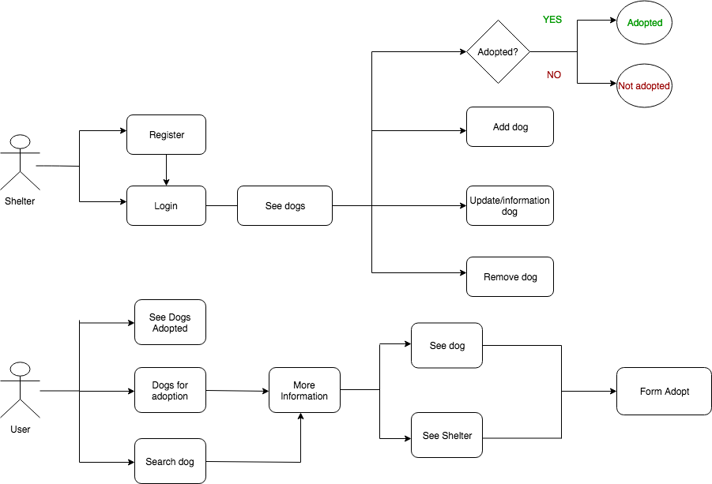
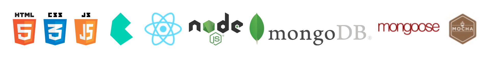
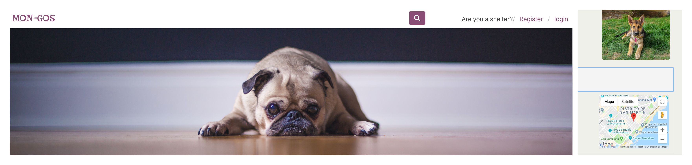
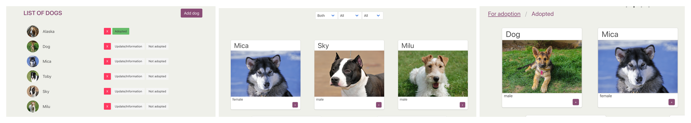
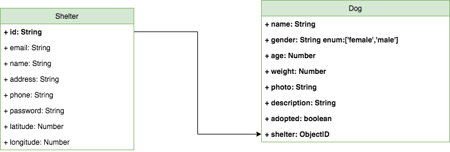
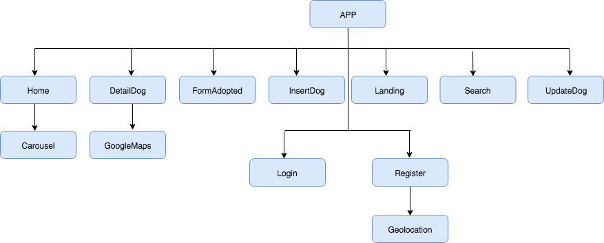
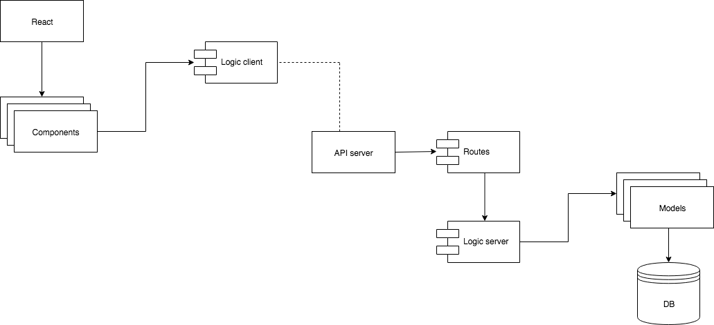

## MON-GOS

## Functional description
This application allows shelters to add pictures, description, dog details(gender,age,weight,status) and modify all this information.

Users will be able to see the dogs, filter them and contact the shelter for adoption information.

## Use case diagram    

## Technical description

## Screenshots

## Data model diagram

## React Components

## Block Model
