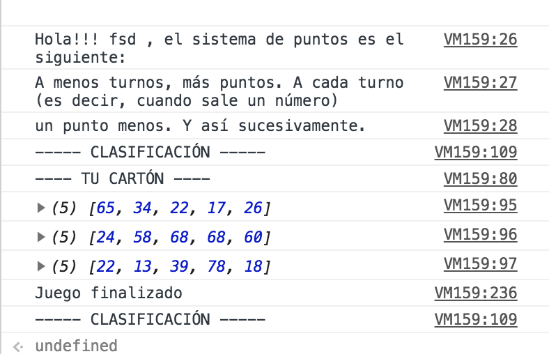

#BINGO

Clásico juego del bingo realizado en JS 

### Objetivo
Consiste en ir sacando números. En el caso de tener uno en nuestro cartón ir tachandolos. 
Hasta completar una línea y posteriormente cantar ¡Bingo!

### Instrucciones
1.   Poner el nombre
2.   Elegir cartón
3. Ir sacando números hasta completar algún objetivo
4. En caso de finalizar el juego hacer click en "Finalizar"

### Imagen

