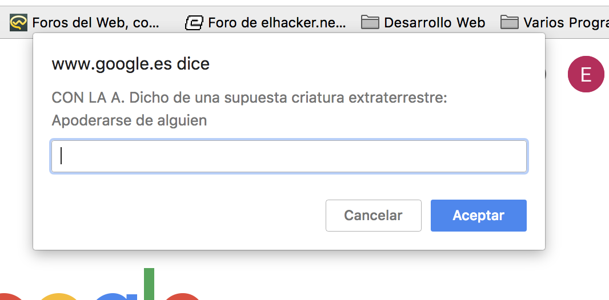

# Pasapalabra JS

Juego realizado integramente en JS del clásico juego de TV

## Instrucciones
1.  Pon tu nombre
2.  Empieza el juego

## Objetivo
Intenta aceptar todas las preguntas que te vayan saliendo. En el caso de no saberla escribir pasapalabra. 
(No hace falta poner mayúsculas ni acentos)

## Imagen
 

