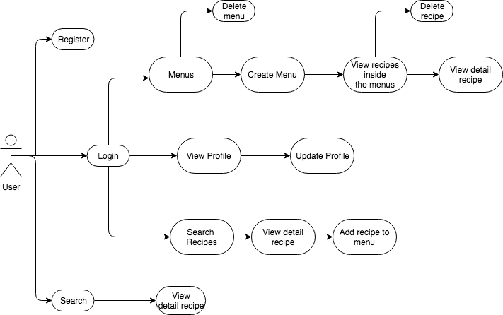
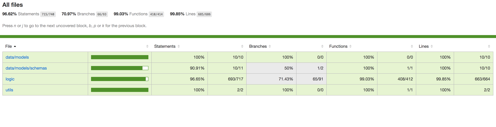
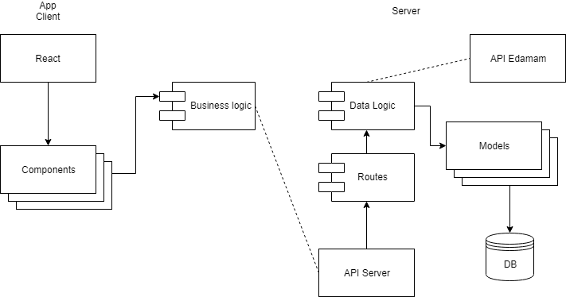
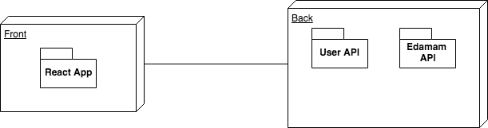
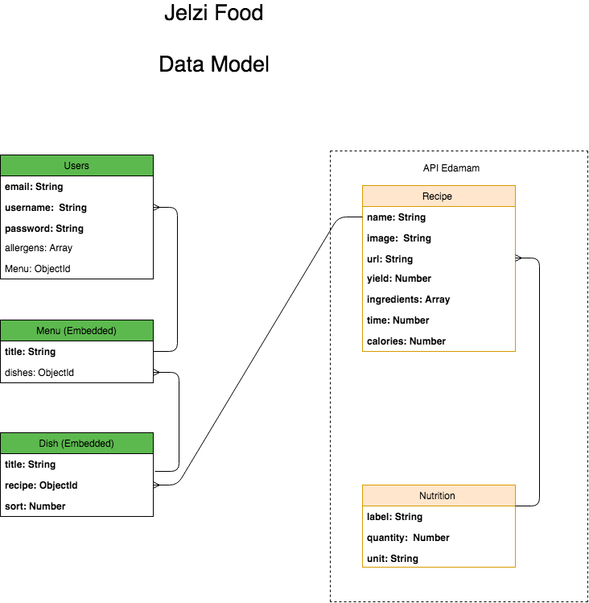

# Jelzi Food App

## Intro

This application is thought to help people with different allergies. The user can create full menus and save recipes without the allergens indicated in their personal profiles.

## Functional description

The APP Jelzi Food allows the user to access to thousands of recipes with allergen filters.

Once registered with their allergens and logged into the application, the user can search filtering by a “query”. By clicking on the recipe, they can find nutritional details and also save the recipes in their own menus, created before.

The user can create menus and, when the recipe has been saved, he can choose the menu and then, enter in the menu. For example, you can save a recipe as breakfast or dinner inside a menu.

### Use Cases

## Technical description

The application is a web application that is meant to run within a browser environment. It consists of a ReactJS frontend with Reactstrap that connects to two APIS:

- a "user" API that handles user data.
- the Edamam API for searching the recipes database

User data is persistent across page reloads, as local data is stored in the user's SessionStorage.

## Api Test

### Components

### Blocks

### Data model

