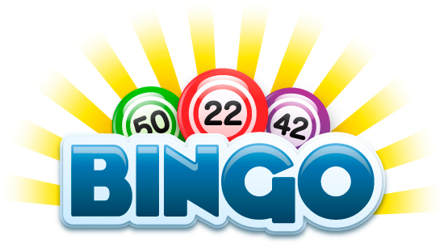

# Bingo

Aplicación Javascript basada en el juego Bingo

- Uso

 * La aplicación te pedirá tu nombre y te asignara un cartón aleatorio
 * A través de un prompt irán saliendo números aleatorios.
 * Si el numero esta en el cartón se marcara con una X
 * Una vez marcados todos los números con X se acabara el juego.

Si tenéis alguna duda podéis escribir a <gbfabre@gmail.com>