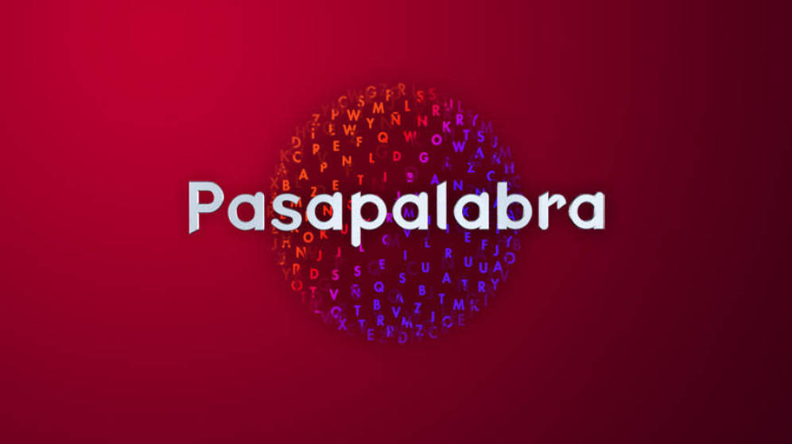

# Pasalacabra

Aplicacion en Javascript basada en el juego Pasapalabra

- Uso

1. La Aplicación hace una pregunta por cada letra del abecedario
2. En pantalla saldrá un prompt donde podrás contestar o pasarpalabra
3. Si acabas el rosco y tienes varias preguntas en pasapalabrs te las volverá a preguntar.
4. Una vez acabado el rosco te dirá la puntuación

Si tenéis alguna duda podéis escribir a <gbfabre@gmail.com>