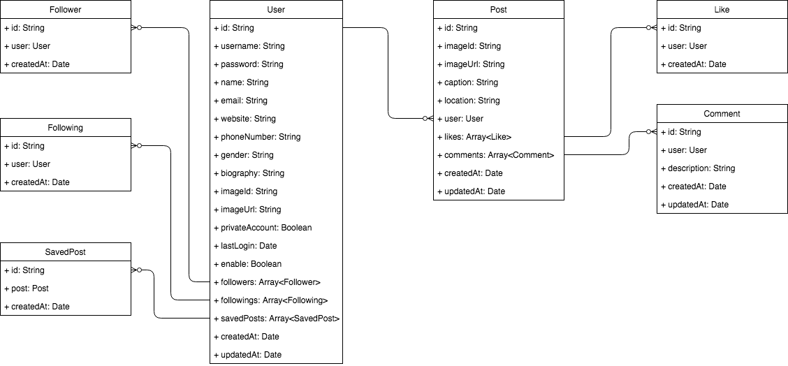

# Inskygram

## Technologies

| Tables   |      Are      |  Cool |
|----------|:-------------:|------:|
| col 1 is |  left-aligned | $1600 |
| col 2 is |    centered   |   $12 |
| col 3 is | right-aligned |    $1 |

| styles| Front-End | Back-End| Test|
| :----------: | :----------: | :----------: | :----------: |
| [Sass](https://sass-lang.com/) | [ReactJS](https://reactjs.org/)  | Node   | [Jest](https://facebook.github.io/jest/)
| [Materialize](https://react-materialize.github.io/#/) | ES6  | TS  | [Mocha](https://mochajs.org/)
| [css-Flex](https://css-tricks.com/snippets/css/a-guide-to-flexbox/) | mditot-type  | RestFul  | [Cosmos](https://github.com/react-cosmos/react-cosmos)

## API

[API doc](https://documenter.getpostman.com/view/2257838/RWaKSo98)

### Data model

