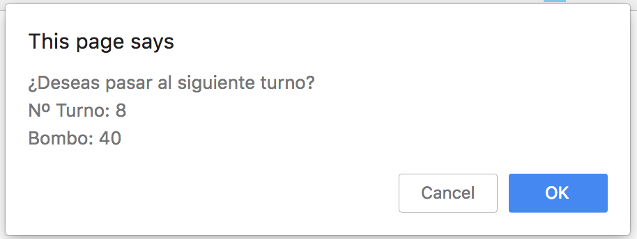

# Bingo

Programa en javascript que simula un Bingo.

- El juego inicia preguntando nombre de usuario
- Durante cada turno se muestra un numero aleatorio en donde el usuario deberá de decidir continuar.
- En cada turno se va mostrando el estado del carton del usuario
- Se mostrará un mensaje "LINEA" cuando ocurrá
- Se mostrará el mensaje "BINGO" cuando se terminen de llenar todos los numeros del carton del usuario.
- Preguntará el continuar la partida

# Screenshot

# Uso

- El usuario deberá de introducir un nombre
- Decidir en cada turno si continuar la partida o salir del juego

# Resources

- [Bingo](https://es.wikipedia.org/wiki/Bingo)
- [Javascript](https://es.wikipedia.org/wiki/JavaScript)