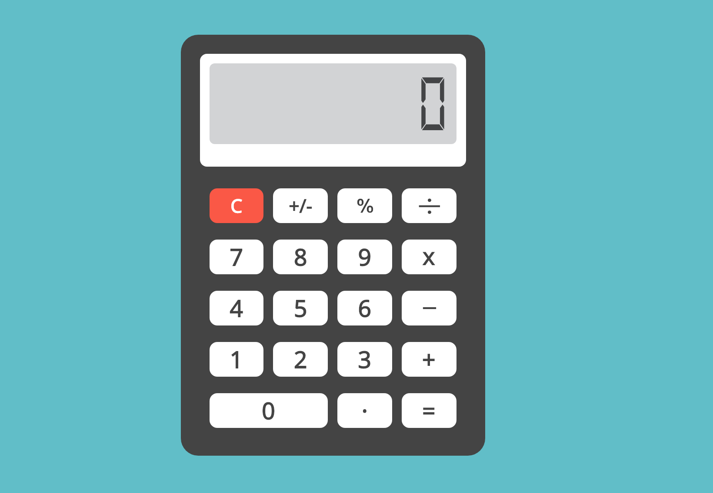

# Calculadora HTML JS CSS

Calculadora web

# Screenshot

# Uso

El uso es mediante el ratón clicando en los botones.

__Botón C__

Limpia la pantalla de la calculadora

__Botónes de numeros__

Guarda en la calculadora los números a calcular

__Botónes de operación__

Calculan los numeros introducidos

# Resources

- [HTML](https://es.wikipedia.org/wiki/HTML)
- [Javascript](https://es.wikipedia.org/wiki/JavaScript)
- [CSS](https://es.wikipedia.org/wiki/Hoja_de_estilos_en_cascada)

