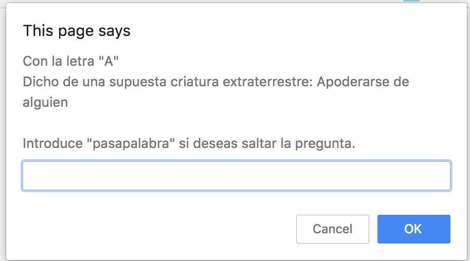

# Pasapalabra JS

El juego es el pasapalabra famoso, haciendo preguntas por cada letra del alfabeto.

Al terminar de responder todas las letras muestra el ranking de usuarios ordenado por mayor puntuación.

# Screenshot

# Uso

- El juego empieza pregunta el nombre del usuario.
- Preguntas a responder. Palabra "pasapalabra" en caso de pasar al siguiente turno.
- Muestra ranking de puntuaciones.

# Resources

- [Javascript](https://es.wikipedia.org/wiki/JavaScript)