# NutriLab v.1.0.0

**INTRODUCTION**

Nowadays, internet is overflowing with dubious diet advice. 
It's not our intention to convince our users to realize any kind of diet and even less this new extreme diets without medical supervision. 

Our main purpose is to concern society that a healthy life is important for our fitness level and mental condition. We think in health as better style life.  

*NutriLab* is a great application about nutrition information. It connects with an extern API of nutrition to allow the user search ingredients and its nutritional information. 

This application allows us to taste more nutritions and its values. This helps on cooking healthier and set aside the common restaurants of *fast-food*. Take the hassle out of counting carbs. Whether you’re managing your blood sugar or following a low-carb diet, carbs control helps you easily see what percent of your day’s calories have been from carbohydrates, fat, and protein so you can manage your intake. You can also set customizable goals and break down your carbohydrate allowance for each meal or snack to help you stay on target.

Get a full-blown nutrient breakdown of every food you eat. From picture, calories and fats to sugars and proteins, *Nutrilab* has comprehensive nutrition data for thousands of foods. It’s easy to look up just about any food. 

**TARGET** 

**Nutrilab** looks for a very extend target, but above all, it is designed to offer ingredients and their details to users that usually like to take care of their health with a special diet, people who don´t know about good habits of nutrition, proffesional athletes or even someone who wants to know more about different type of products.

**TECHNOLOGIES**

We've used an Agile working methodology that consists on team working.
- Html5 and Javscript ES6. 
- CSS (Sass and BEM) to style our application.
- Jasmine to testing our logic.
- React.js to do the connexion of our logic, our style, our structure and our data info with an extern API called Nutriotionix.

**FUNCTIONAL DESCRIPTION**

The user may register and/or login to search different ingredients. Then, he or she could click on each list to see the details of this nutrient. It is also possible to add them to a favorite list that can find on the nav bar.

#### UML Diagram about functional description

Use Case Diagram:

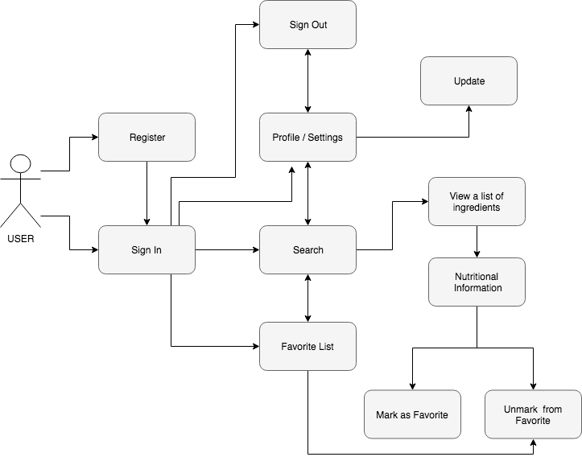

Flow Diagram:

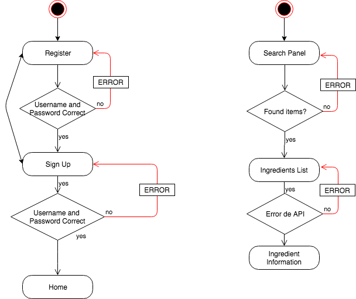

**TECHNICAL DESCRIPTION**

We can see in the diagrams below the flow of the app.

#### UML Diagram about technical description

Block Diagram:

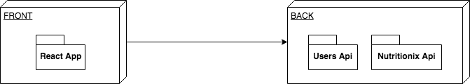

Components Diagram:

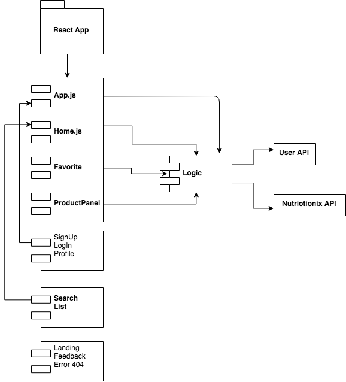

Data Model Diagram:

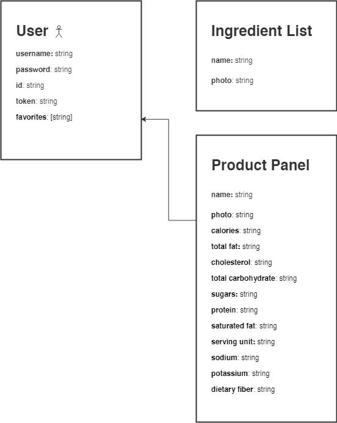

Classes Diagram:

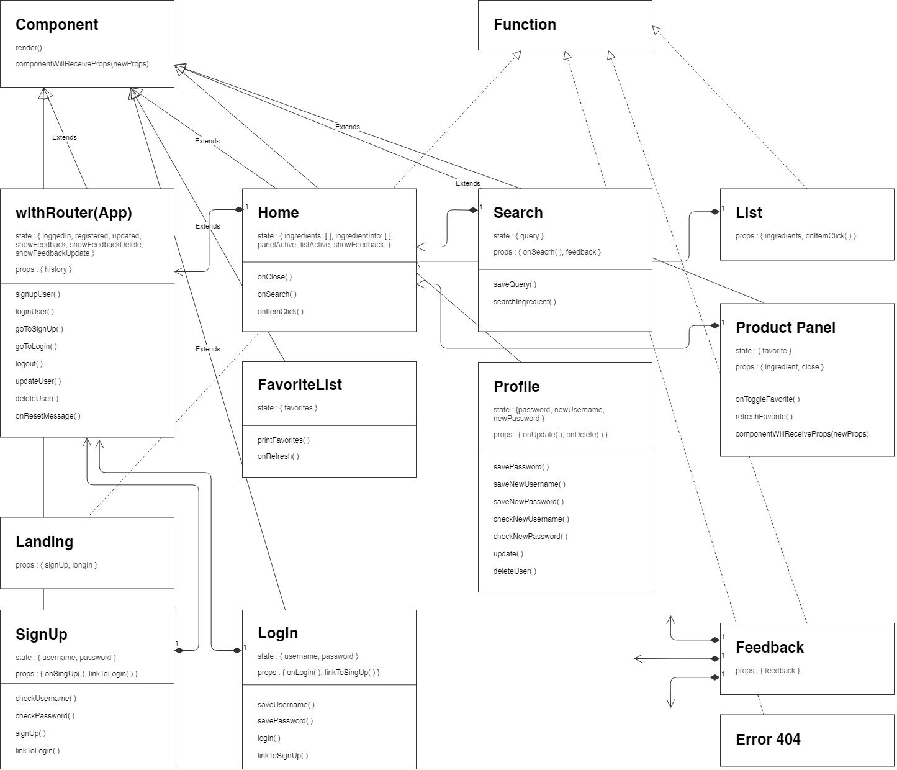

**DESIGN**

#### Landing

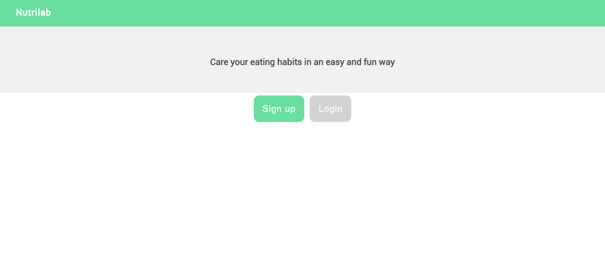

#### SingUp / LogIn

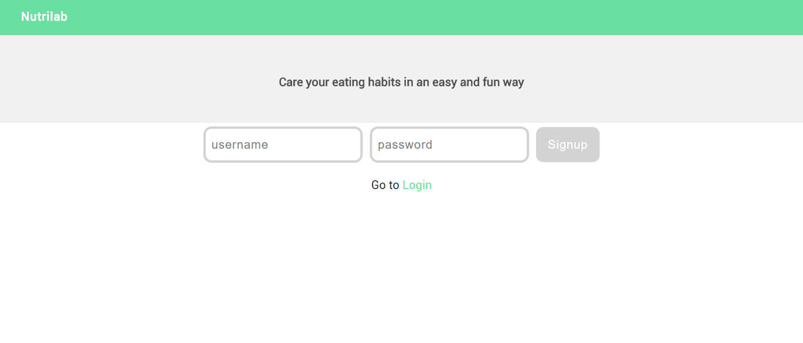

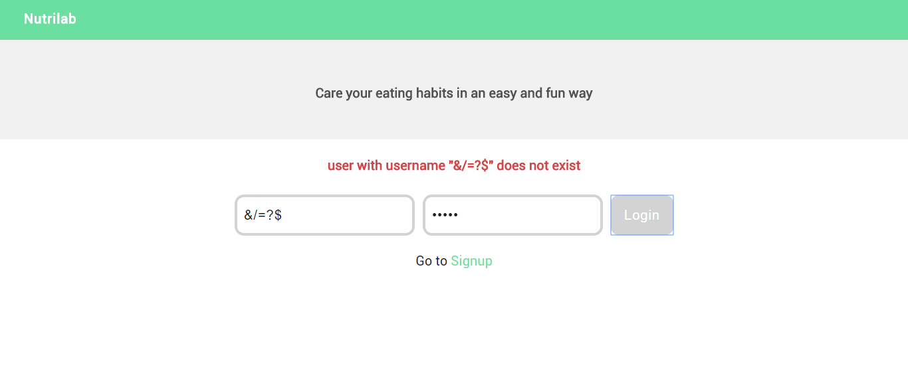

#### Home / Search Panel

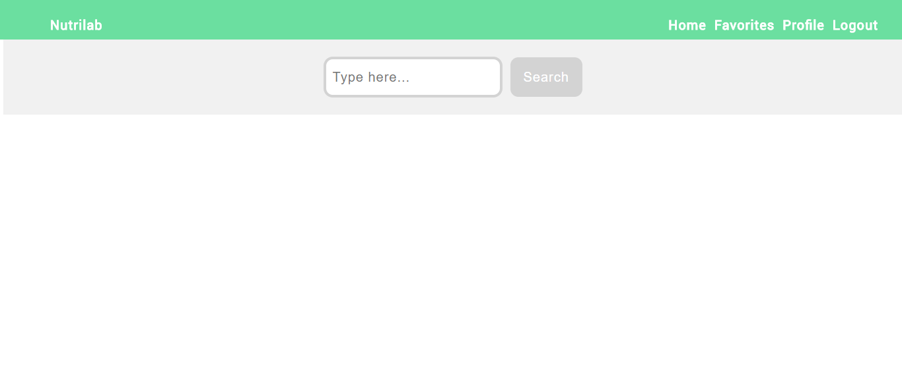

#### Profile

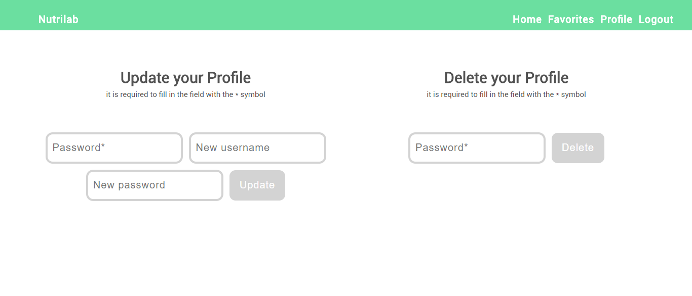

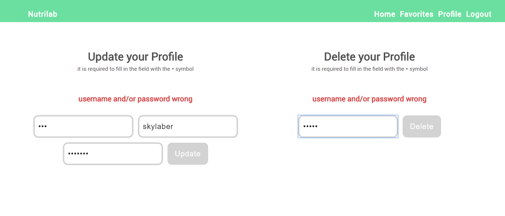

#### Ingredients List

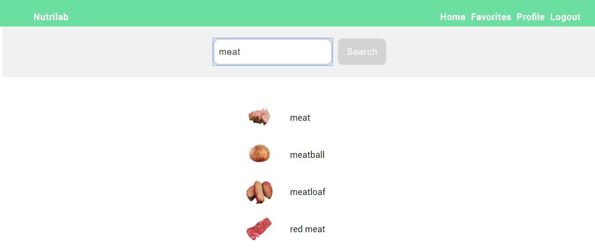

#### Ingredient Information

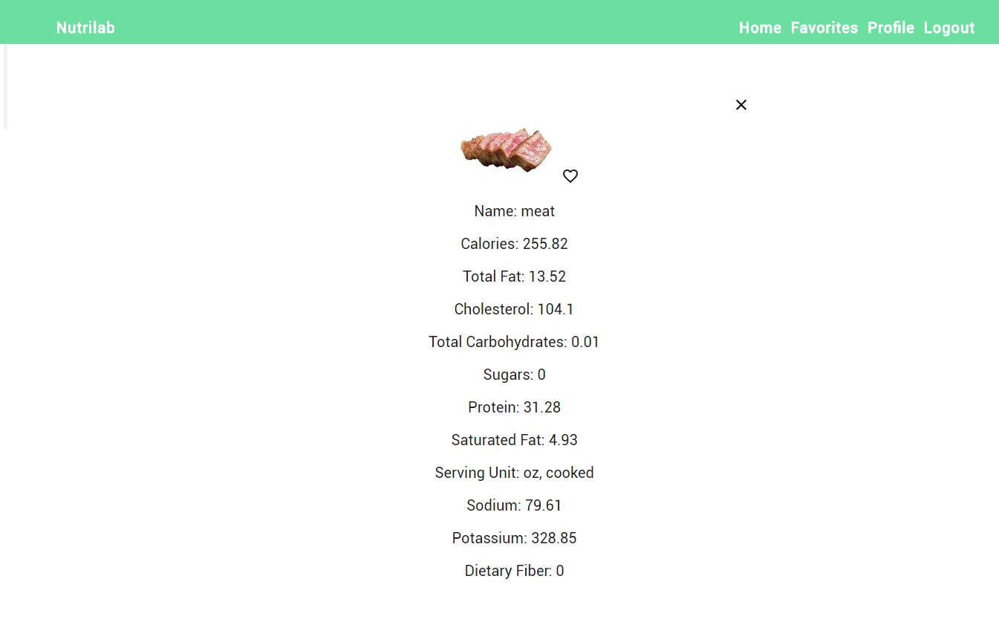

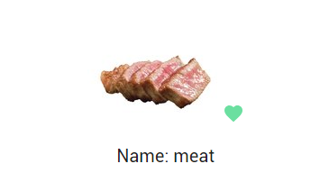

#### Favorite List

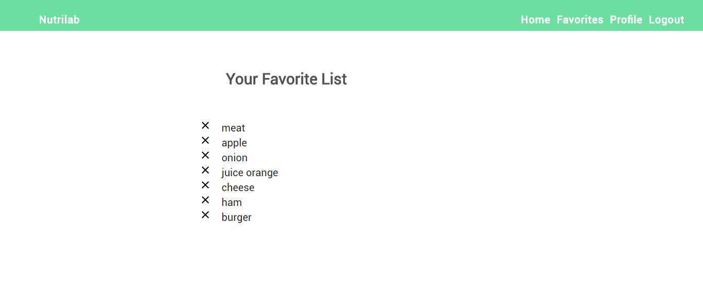

#### Error 404

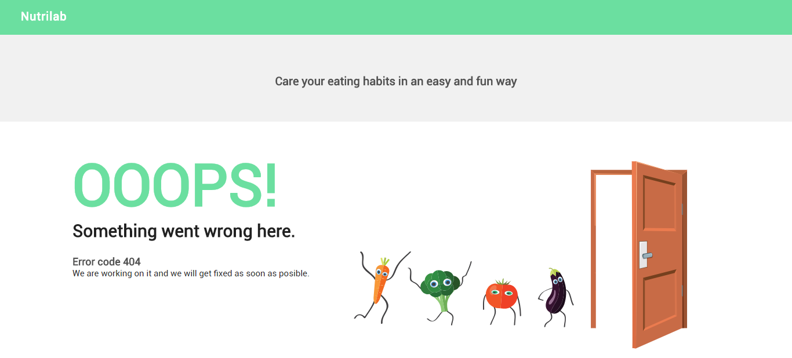

**AUTHORS**

- Jordi Ubanell
- Sergio Castillo
- Maider Hernandorena