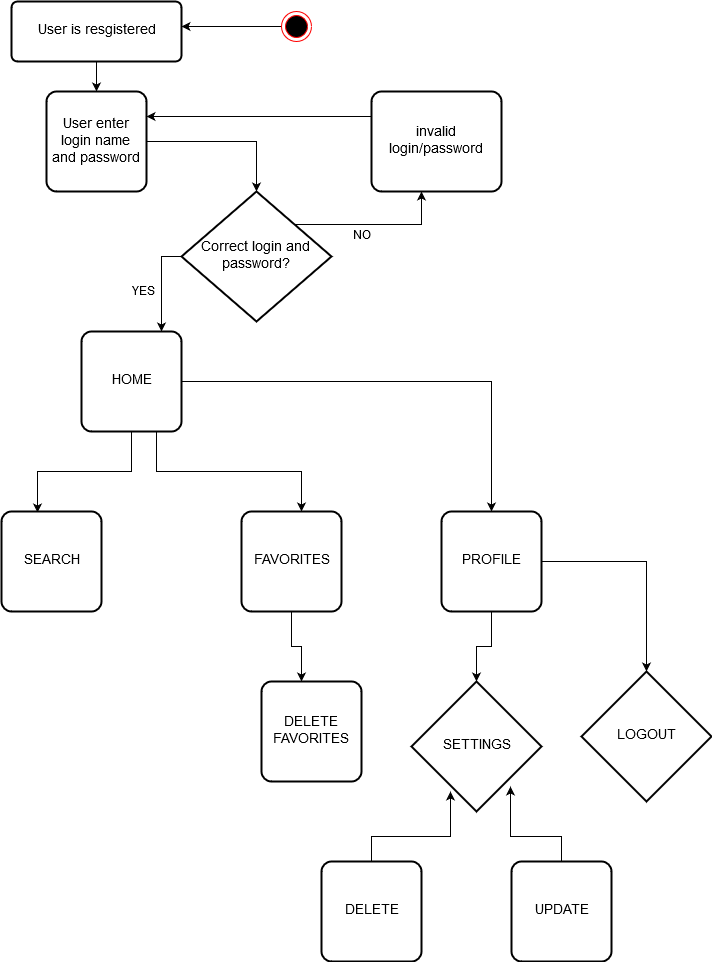
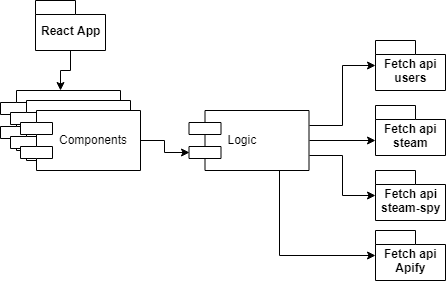

# Functional description

<<<<<<< HEAD
Inside our application, you'll be able to search some games of Steam and mark them as favourite, and delete them if you don't like them anymore. Apart of that, you can visit its official web site on Steam.
=======
Inside our application, you'll be able to search some games of Steam and mark them as favourite, or delete them if you don't like it anymore. Apart of that, you can visit its official web site on Steam.
>>>>>>> feature/stim-burton-Javi

## Use Cases

## Activity Diagram

# Technical description

## Component Diagram

## Block Diagram

## Data Diagram
<<<<<<< HEAD

## Activity Diagram

=======

>>>>>>> feature/stim-burton-Javi
