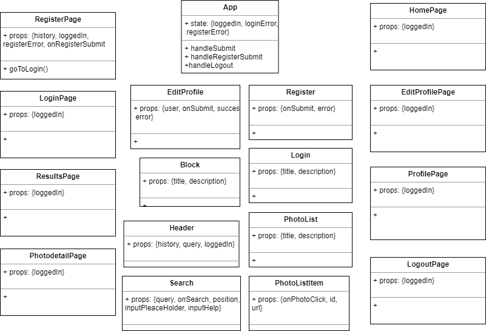
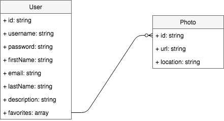

# Inspire App

## Introduction

Inspire app se trate de un buscador de fotos de alta calidad en cual los usuarios se pueden registrar y crear sus propia lista de favoritos. 

## Functional description

### Use cases

### Activities (flows)

#### Login

#### Register

#### Search

## Technical description

### Blocks

### Components

### Sequences

### Classes

### Data model
