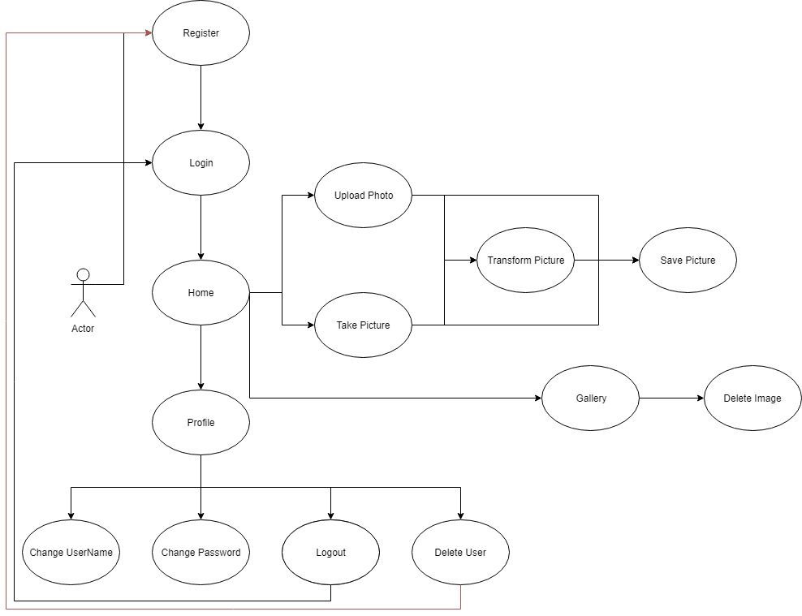
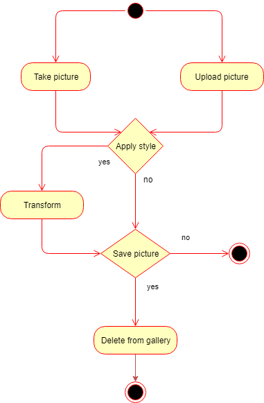
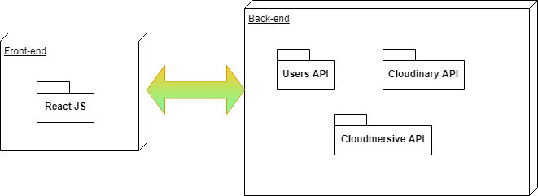
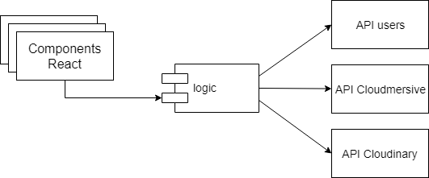
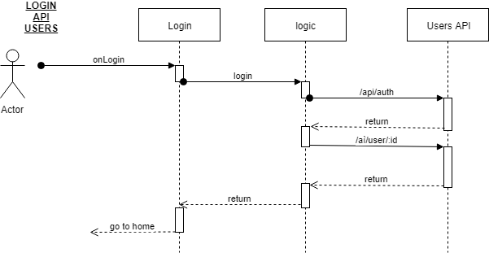
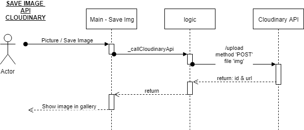
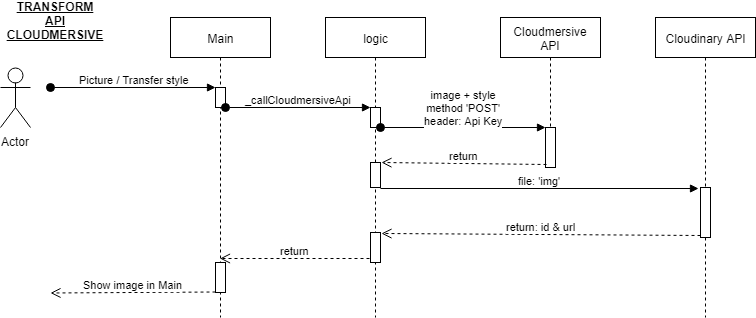
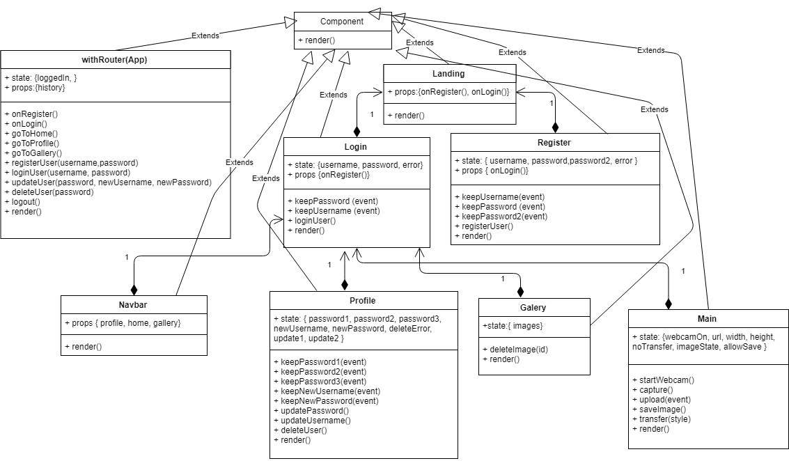
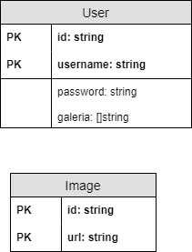

# Gallery App

## Introduction

This application lets you upload pictures and apply different styles.
You also can take pictures from your webcam and save the results in your own gallery.

It was developed as a front-end project for the Skylab Coders bootcamp (Barcelona, 2018). The objective was to apply the following technologies in a real life application:

- HTML
- CSS
- Javascript (ES6)
- React 
- React Router
- Sass
- BEM
- APIs

## Functional description

### Use cases diagram

As a user you can register and login. Then, you can take a picture with your webcam or upload a picture from your files. You can save the picture in your gallery and apply a style to it.
You can also update your information and delete your acount.

### Activity diagram

We have two principal activities, upload a picture or take a picture. You can choose to apply some style and save the picture in the gallery. Finally, you can choose to delete the picture when you want.

## Technical Description

### Block diagram

The front end of the application was built using React. The back end is connected to 3 APIs in order to manage the users, store the images (cloudinary) and transform the images (cloudmersive).

### Components Diagram

Our application has some react components, the business logic and the three APIs that we use: UserAPi, CloudinaryAPI and CloudmersiveAPI.

### Sequence Diagram

In this application, we have some repetitives tasks. The most significant are those that use the APIs.
Cloudinary API is used to save the images and the Cloudmersive API is used to transform the images, if the user decides to add a style to them.

- Users API

- Cloudinary API

- Cloudmersive API

### Class Diagram

We have differents components: App, Main, Landing, Login, Register, Gallery, Profile and Navbar. All extend from Component.
In this diagram we have the interaction between the components.

### Data Diagram

Our logic has two componentes: the image and the user. The user is represented with a username, id, password and gallery. An image is represented with its id and the public url. 

