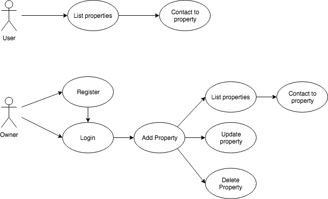
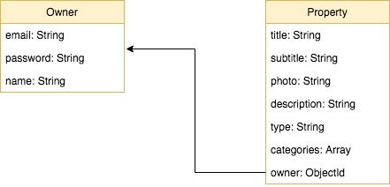
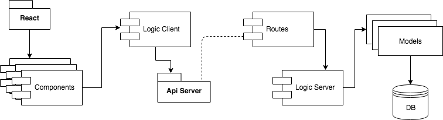
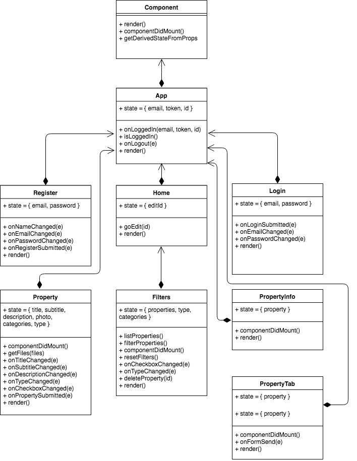

# LOCATIONS

# Description
Locations is a real estate app focused on properties specializing in film shoots, events, photo shoots, among other things ... unlike others, an owner can be completely autonomous to upload their properties and can manage them

# Uses Cases Diagram

# Technical description

# Data Model Diagram
 

# Block Model Diagram

# Block Components Diagram

# Components Diagram

# Authors
- Jaume [GitHub](https://github.com/jaumeserr)

