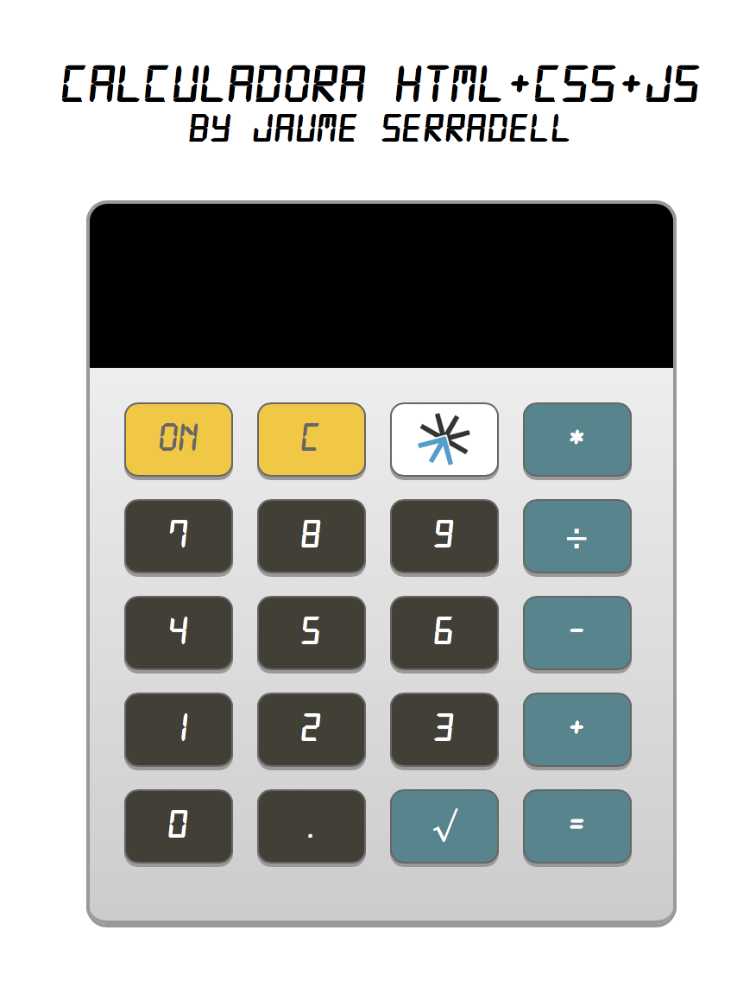

# CALCULADORA-WEB

Aplicación de una calculadora del precurso. Simularemos una calculadora dónde juntaremos diferentes lenguajes, como serían HTML, CSS y JavaScript



## Usage

``` sh
$ open index.html
```

## Modo de uso