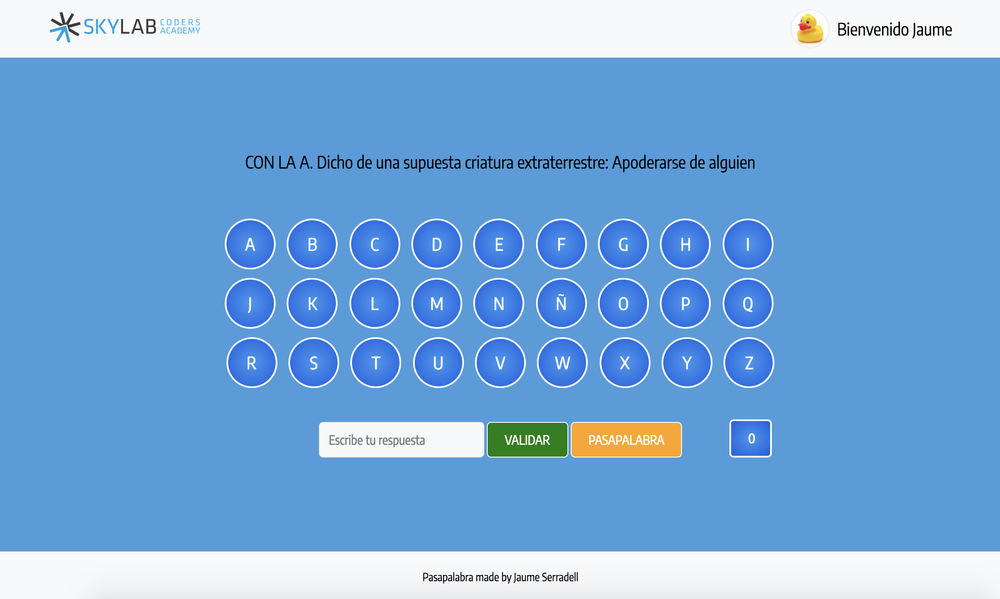

# PASAPALABRA-WEB

Aplicación del juego de pasapalabra donde hemos juntado diferentes lenguajes aprendidos en el precurso, que serían HTML, CSS y JavaScript



## Usage

``` sh
$ open index.html
```

## Modo de uso

