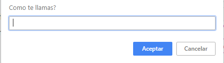
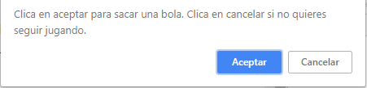

# Documentación Bingo

Aplicación del precurso en Javascript que consiste en iniciar el juego llamado bingo.

## Iniciar Codigo

Debes llamar a la función padre utilizando la consola de google.

Puedes llamarla introduciendo el siguiente codigo:

```
bingo();
```

## Instrucciones

Al iniciar la aplicación te aparecerá un pop-up que te pedirá un nombre de usuario para poder iniciar el juego, en caso de que no pongas ningún nombre, la aplicación volverá a pedirtelo hasta que introduzcas agluno.



Una vez iniciado, la aplicación te generará una lista de numeros aleatorios y los meterá en un array. Seguidamente te preguntará si quieres pedir un numero.
En caso de pedirlo, te generará otro numero aleatorio, si dicho numero coincide con los que hay en el array, te sustituirá el numero que hay en el array por una X, para marcar los numeros que has conseguido.



Cuando hayas marcado todos los numeros del array te aparecerá la palabra bingo!