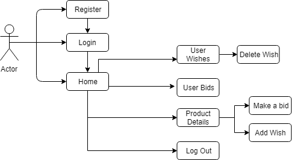
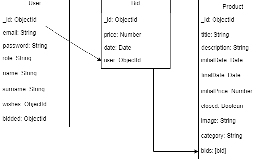
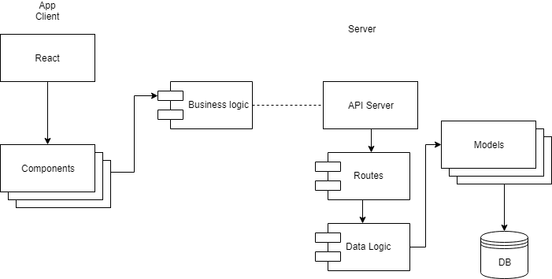

## Thunder-Bid

## Functional description
This application allows users to make bids to the different products, mark them as a wish and delete them if they don't like it anymore. They can see their bid of each price and if they are winning it or not.

Users will be able to see the dogs, filter them and contact the shelter for adoption information.

## Use case diagram    

## Technical description

## Data model diagram    

## Block model diagram
