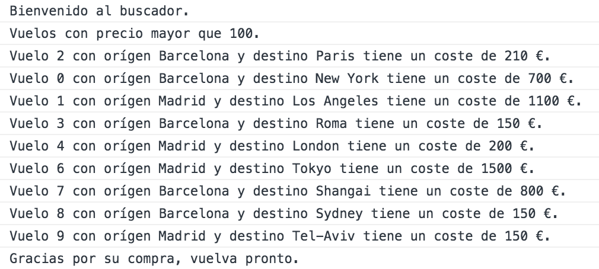
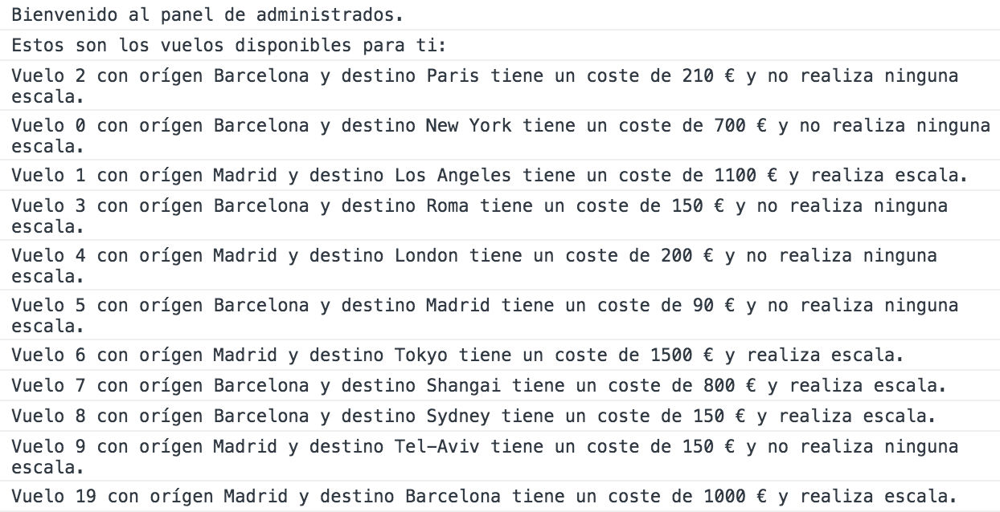

# Airlines

This is a simple flight management console application built with Javascript.

## Usage

Copy and paste the code inside the file _**airlines.js**_ into your browser console and call the function main() to start.

```js
main()
```
As a _USER_ you can see and filter flights by prices.



As an _ADMIN_ you can delete or add new flights. 


