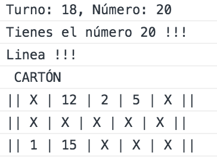

# Bingo

This is a javascript implementation of the game BINGO for the console.

## Usage

Copy and paste the code inside the file _**bingo.js**_ into your browser console and call the function bingo() to start.

```js
bingo()
```

Introduce your name, confirm or change your board and play the game.

Stats are recorded in the end to build a ranking table with the best scores.

