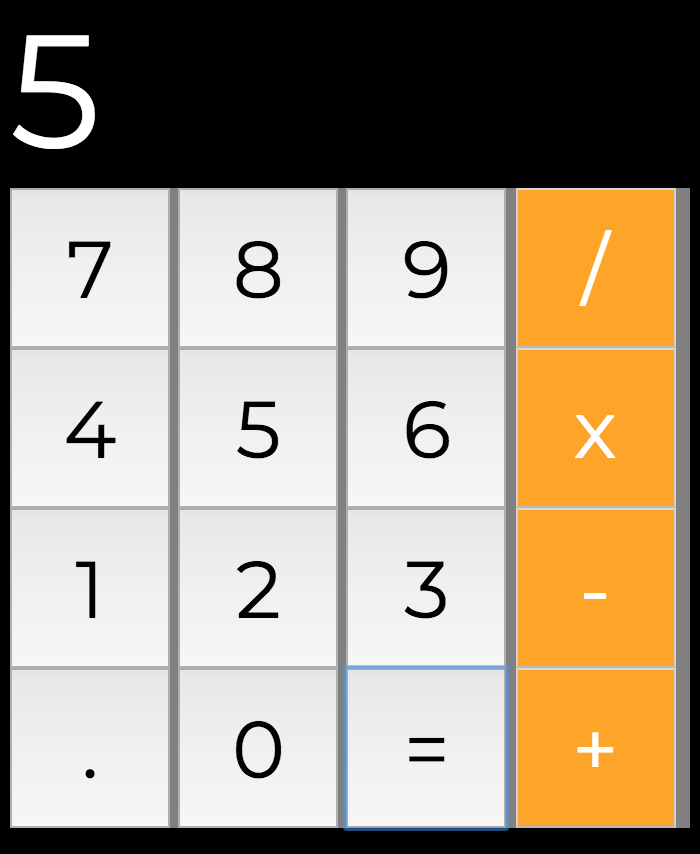

# Calculator

 This is a simple implementation of a calculator built with HTML, CSS and Javascript.

 ## Usage

 Open the file _**index.html**_ in your browser and start using the calculator app.

  