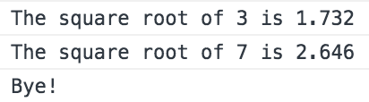
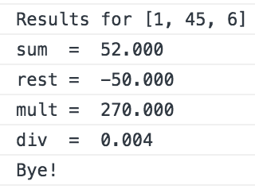

# Calculator

This is a simple calculator built with Javascript.

## Usage

Copy and paste the code inside the file _**calculadora.js**_ into your browser console and call the function calculator() to start.

```js
calculator()
```
 If only one number is introduced, the square root is computed.

 

 If two ore more numbers are introduced, the sum, difference, multiplication and division is computed.

 

