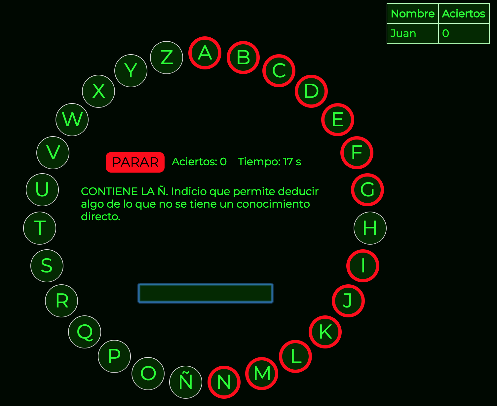

# Pasapalabra

 This is a simple implementation of the game _PASAPALABRA_ built with HTML, CSS and Javascript.

 ## Usage

 Open the file _**index.html**_, insert your name and start playing !

  

 Answer all the questions before the timer stops !

Stats are recorded in the end to build a ranking table with the best scores.