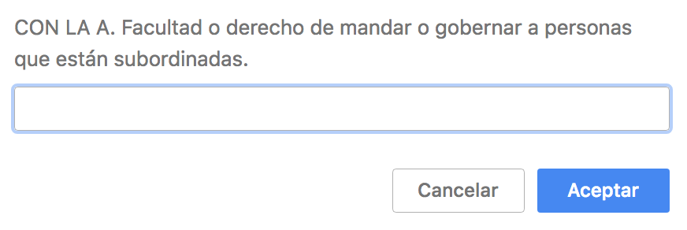

# Pasapalabra

This is a javascript implementation of the game PASAPALABRA for the console.

## Usage

Copy and paste the code inside the file _**pasapalabra.js**_ into your browser console and call the function pasapalabra() to start.

```js
pasapalabra()
```

Introduce your name  and start the game. Answer all the questions before the timer stops !

Stats are recorded in the end to build a ranking table with the best scores.

