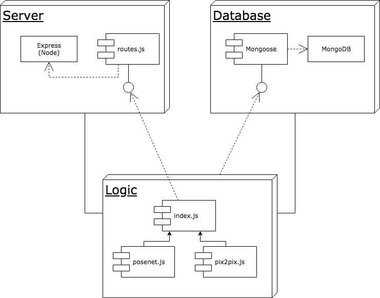
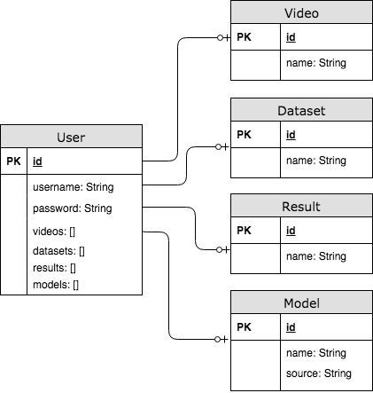

# Pose2Pose - API

## Introduction

This API is designed to work with the Pose2Pose web application. The endpoints are designed for user management, video storage and content creation using machine learning models.

The API is implemented in Node and Express, using MongoDB as a database. 

## Endpoints

### User management

Register a user with a username and password.

```bash
POST /api/register
```

```bash
body {
    username, 
    password
}
```

Get authorization for a user.

```bash
POST /api/auth
```

```bash
body {
    username, 
    password
}
```

returns the user **id** and a valid **token**.

Update username.

```bash
PUT /api/users/:id/updateUsername
```

```bash
authorization: Bearer TOKEN
```

```bash
body {
    newUsername, 
    password
}
```

Update password.

```bash
PUT /api/users/:id/updatePassword
```

```bash
authorization: Bearer TOKEN
```

```bash
body {
    newPassword, 
    password
}
```

Delete user

```bash
DELETE /api/users/:id
```

```bash
authorization: Bearer TOKEN
```

```bash
body {
    password
}
```

### Video management

Save video.

```bash
PUT /api/users/:id/videos
```

```bash
authorization: Bearer TOKEN
```

```bash
FormData: file
```

Delete video.

```bash
DELETE /api/users/:id/videos/:videoId
```

```bash
authorization: Bearer TOKEN
```

Retrieve all videos for a user

```bash
GET /api/users/:id/videos
```

```bash
authorization: Bearer TOKEN
```

returns an **array** with the **ids** of all the users' videos.

Download a video

```bash
GET /api/users/:id/videos/:videoId
```

```bash
authorization: Bearer TOKEN
```

returns the **stream** object of the video.

### Dataset management

Create dataset.

```bash
PUT /api/users/:id/datasets
```

```bash
authorization: Bearer TOKEN
```

```bash
body {
    videoId,
    settings
}
```

Delete dataset.

```bash
DELETE /api/users/:id/datasets/:datasetId
```

```bash
authorization: Bearer TOKEN
```

Retrieve all datasets for a user

```bash
GET /api/users/:id/datasets
```

```bash
authorization: Bearer TOKEN
```
returns an **array** with the **ids** of all the users' datasets.

Download a dataset

```bash
GET /api/users/:id/datasets/:datasetId
```

```bash
authorization: Bearer TOKEN
```

returns the **stream** object of the dataset.


### Results management

Create result.

```bash
PUT /api/users/:id/results
```
```bash
authorization: Bearer TOKEN
```
```bash
body {
    datasetId,
    modelId,
    settings
}
```
Delete result.

```bash
DELETE /api/users/:id/results/:resultId
```

```bash
authorization: Bearer TOKEN
```

Retrieve all results for a user

```bash
GET /api/users/:id/results
```

```bash
authorization: Bearer TOKEN
```
returns an **array** with the **ids** of all the users' results.

Download a result

```bash
GET /api/users/:id/results/:resultId
```

```bash
authorization: Bearer TOKEN
```

returns the **stream** object of the result.


### Models management

Retrieve all models

```bash
GET /api/users/:id/models
```

```bash
authorization: Bearer TOKEN
```
returns an **array** with the **ids** of all the users' models.

Download a model

```bash
GET /api/users/:id/models/:modelId
```

```bash
authorization: Bearer TOKEN
```

returns the **stream** object of the model.


## Technical description

### Components diagram

The API uses **Node** and **Express** to set up the server. The routes are defined in **routes.js**. Files are stored locally inside the **data** and **model** folders. User and files information is stored in **MongoDB**. The business **logic** controlls the data flow between the API endpoints, the local storage and the database.



### Data diagram

The API uses **mongoose** to define schemas and models. Files information are stored in the User model as arrays of ids, linking the different collections.

