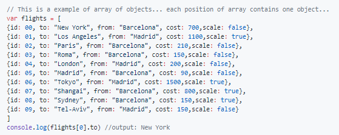

# AEROLINEA

## SEGUNDO PROYECTO DEL PRECURSO

Programa una inferfaz de usuario para una aerolinea (por terminal...). Esta aerolinea dispondrá de 10 vuelos para el dia de hoy, para empezar, estos vuelos estarán declarados de manera global. 

[instrucciones](https://github.com/agandia9/Subjects-PreCourse/blob/master/mini-proj.md)

