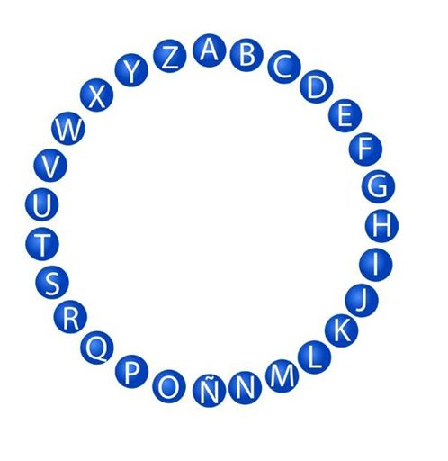

# PASAPALABRA

## ULTIMO PROYECTO DEL PRECURS

JUGUEMOS A PASAPALABRA

*emfasis*

**strong emfasis**

~~algo loco tachado~~

+ primero piensa
+ luego existes

1. P
2. robando

Estoy escribiendo cosas y quiero poner un link google.com 

[instrucciones](https://github.com/agandia9/Subjects-PreCourse/blob/master/mini-proj.md)

