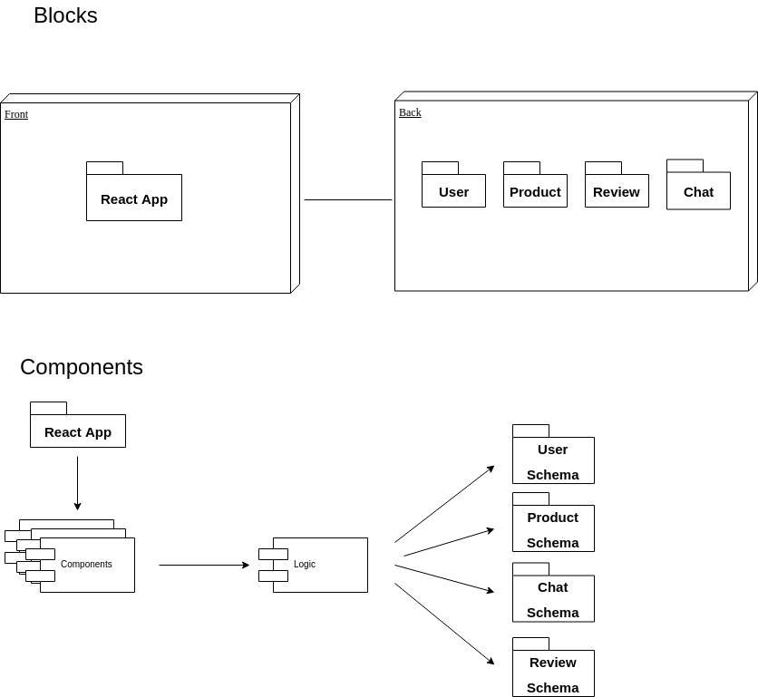
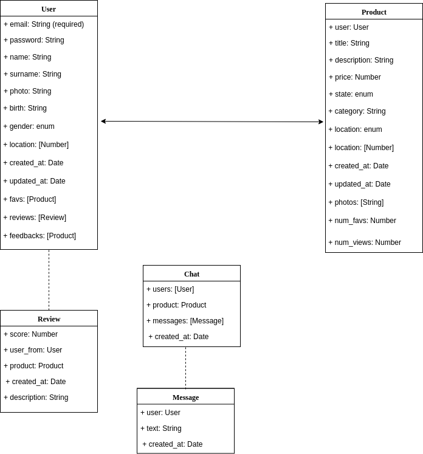

# Description
BabyBoom is a marketplace company which offers a website dedicated to the purchase and sale of second-hand -baby related- products among users through the Internet. Use geolocation so that users can buy and sell based on their geographical proximity.

Uses Cases

Login sequence

Save Profile and Products photos to Cloudinary Sequence

Block Components

Schemas

# Authors

- Laia [GitHub](https://github.com/laia89)

