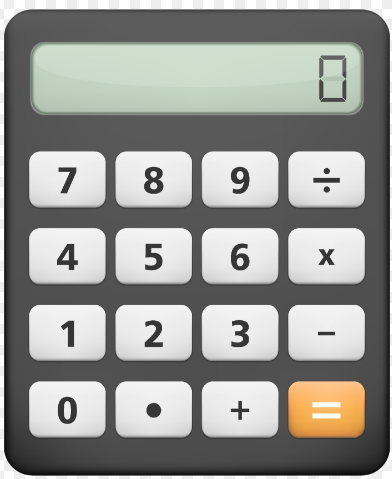

# CALCULATOR

To start using the calculator, the user must download the project. After that, inside the calculator folder open the index.html file:

```sh
$ open index.html
```



## Usage
- Tap a number, the operator and another number.
- The result will appear on the display after the "equal" sign is pressed.


## References

[Calculator](https://en.wikipedia.org/wiki/Calculator)
