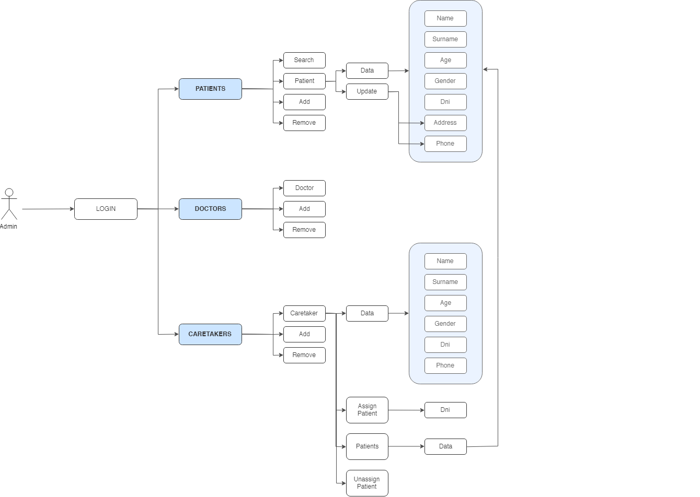
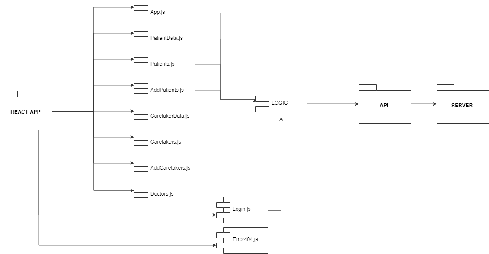

# Reminder Admin App v.1.0.0

**INTRODUCTION**

This is a functional and usable app for an hospital administration, where the administrative could register doctors, patients and caretakers of this ones. They could also assign patients to them, so anyone could be steal data or remove information of this patients without authorization.

**TECHNOLOGIES**

The technologies used in this application are next ones:

- React JS
- Sass & BEM
- Mocha & Chai (for testing)

**FUNCTIONAL DESCRIPTION**

The admin must login with a code and password the hospital gave him/her. He/she would see a patient list and a search panel to search them by their names. There would be an option to add more patients too. Is this one is clicked, another page would appear where the admin could enter all data required of the patient.

Moreover, the admin could see all doctors in the hospital (named with codes) and add more too. And last but not least, could see all caretakers listed, add more with their data and also assing patients to that caretakers, therefore no one could steal any information of them, only administration could assign those patients to their caretakers.

#### Diagram about functional description

Use Case Diagram:

**TECHNICAL DESCRIPTION**

We can see in the diagrams below the flow of the React App.

#### Diagram about technical description

Components Diagram:

Classes Diagram:

**LIVE DEMO**

[Reminder Admin App](https://reminder-app-admin.surge.sh)
