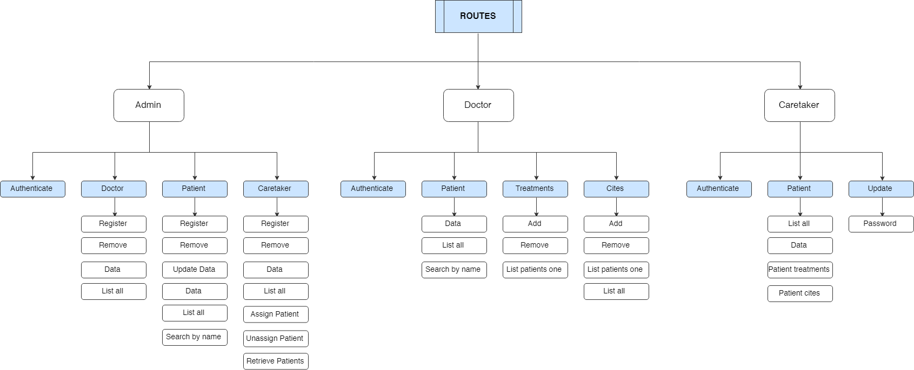
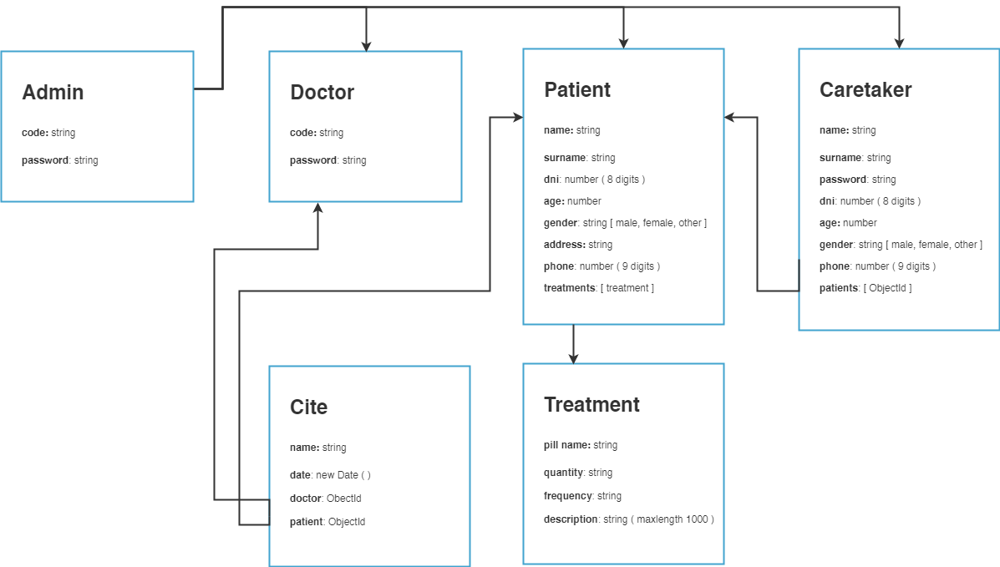
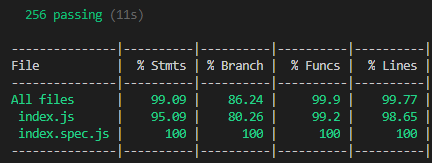

# Reminder Api v.1.0.0

**INTRODUCTION**

The api of reminder apps connects with the data base and registers there all the information needed. 

**TECHNOLOGIES**

The technologies used in this api are next ones:

- Express
- MongoDB & Mongoose
- Mocha & Chai (for testing)

**TECHNICAL DESCRIPTION**

We can see in the diagrams below the flow Api.

Api Flow Diagram (Routes)

#### Data models

There are 6 different Schemas: 

- Admin: administrative of the hospital who registers and removes doctors, patients and caretakers, and also assigns patients to caretakers.
- Doctor: has patients and cites and can add cites and treatments to the patients.
- Patient: has data, cites and treatments.
- Caretaker: has assigned patients with their data, cites and treatments.
- Cites
- Treatments

Data models:

#### Testing API

