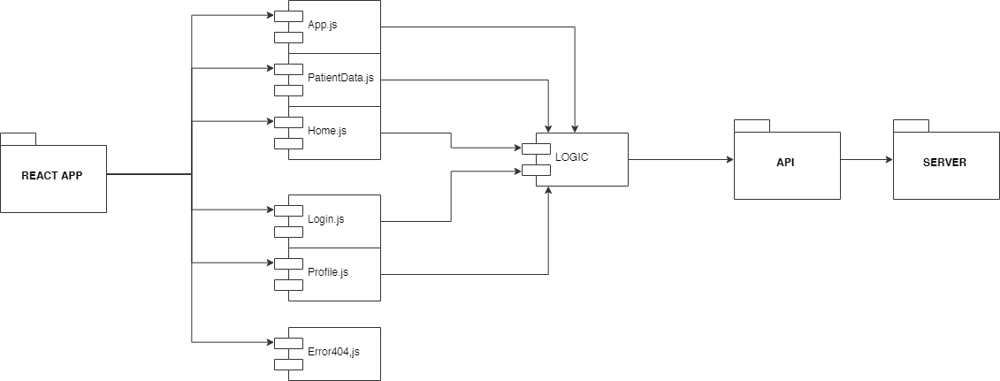
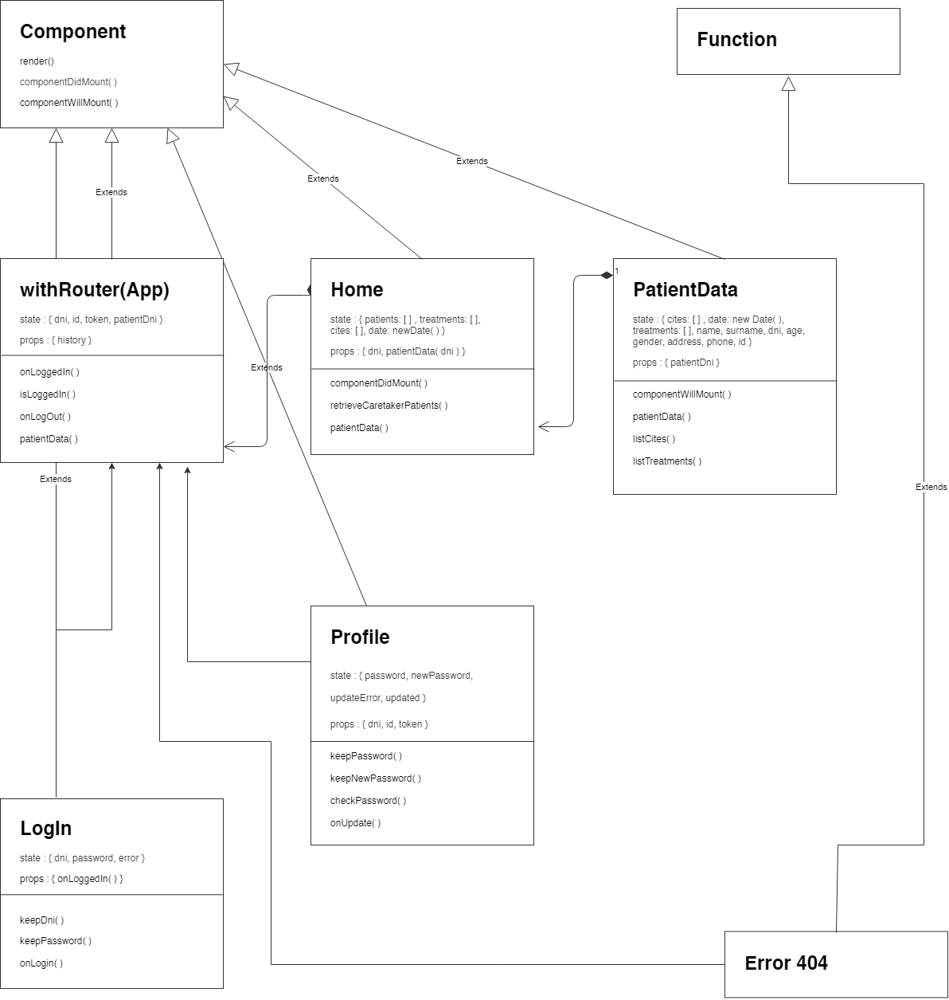

# Reminder Caretaker App v.1.0.0

**INTRODUCTION**

This is a functional and usable Progressive Web App for a patient caretaker. To see their patients data, cites and treatments, so then they could control more and for example, do not forget to take a pill. 

It is mainly aimed at patients with Alzheimer. Therefore, the caretaker if has more than one patient to take care about, would have no problems to remember the treatments each one has to take or the cites with the doctors. He/She may run the Reminder Caretaker App and see all the information needed.

**TECHNOLOGIES**

The technologies used in this application are next ones:

- React JS
- Sass & BEM
- Mocha & Chai (for testing)

**FUNCTIONAL DESCRIPTION**

The caretaker must login with his/her dni and password the admin gave him/her. He/she would see his/hers patients. If one of themis clicked another panel would appear with this patient data, treatments and cites. 

Moreover, the caretaker could have the option to update his/her password on the profile panel. As the password given at the first time is a random one the administration selected, maybe the person who uses the App prefers to update it.

#### Diagram about functional description

Use Case Diagram:

**TECHNICAL DESCRIPTION**

We can see in the diagrams below the flow of the React App.

#### Diagram about technical description

Components Diagram:

Classes Diagram:

**LIVE DEMO**

[Reminder Caretaker App](https://reminder-app-caretaker.surge.sh)
