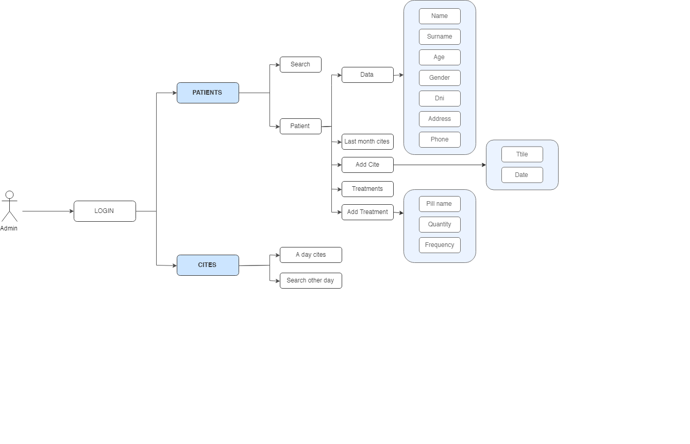
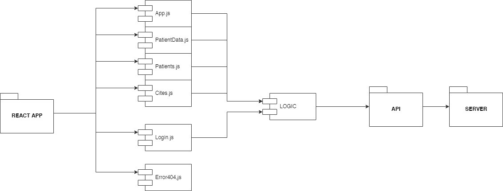
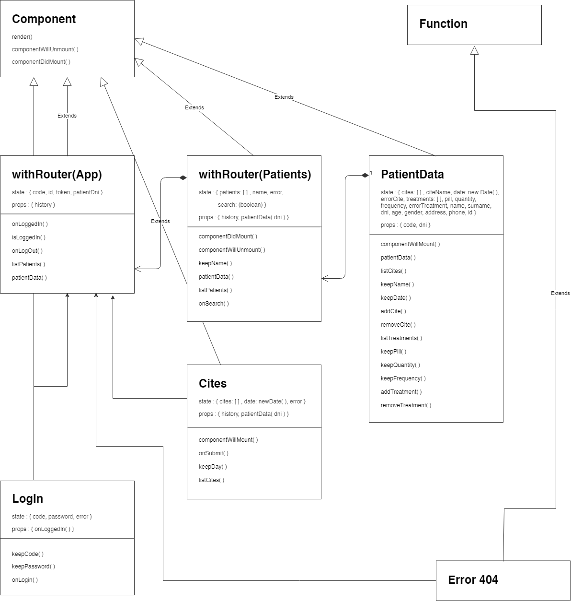

# Reminder Caretaker App v.1.0.0

**INTRODUCTION**

This is a functional and usable app for a hospital doctor. To see their patients data, cites and treatments, so then they could control more. Doctors also could see the cites they have on a specific day, so they could not forget assisting or could control with whom are going to meet. 

**TECHNOLOGIES**

The technologies used in this application are next ones:

- React JS
- Sass & BEM
- Mocha & Chai (for testing)

**FUNCTIONAL DESCRIPTION**

The doctor must login with his/her code and password the admin gave him/her. He/she would see all patients and could search them too. If one of them is clicked, another panel would appear with this patient data, treatments and cites. There, the doctor could add more cites and more treatments to these patients.

Moreover, the doctor could see all the cites he/she has on that day or another day (just clicking the day on the option). This, helps the doctor to have a control of what he/she has to do on that day and with whom would meet.

#### Diagram about functional description

Use Case Diagram:

**TECHNICAL DESCRIPTION**

We can see in the diagrams below the flow of the React App.

#### Diagram about technical description

Components Diagram:

Classes Diagram:

**LIVE DEMO**

[Reminder Doctor App](https://reminder-app-doctor.surge.sh)
