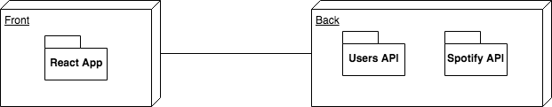

# Spotify App

## Intro

Lorem ipsum dolor sit amet, consectetur adipiscing elit. Pellentesque condimentum aliquam lacus, sed sollicitudin odio auctor ut. Quisque molestie sapien ac suscipit sollicitudin. Praesent eu lacinia ligula. Etiam tristique nec orci non commodo. In blandit mollis consectetur. Aenean at est non nunc laoreet tincidunt nec et lorem. Vestibulum consectetur quis lorem at maximus. Proin venenatis est nec felis pretium consequat. Praesent arcu erat, ultricies ac sem mattis, egestas malesuada nulla.

Aenean a risus nec sem ultrices pulvinar. Aenean quis orci euismod, ultrices nulla vel, consequat turpis. Suspendisse eu velit quis velit feugiat fringilla sed facilisis lectus. Donec enim mauris, euismod vel purus vel, euismod tristique mi. Fusce a lacinia mauris. Ut eget risus aliquam, auctor mauris nec, elementum tortor. In et imperdiet sem, at lacinia augue. Integer a facilisis lectus, at congue erat. Praesent dapibus leo in odio aliquet, ut facilisis quam porttitor. Lorem ipsum dolor sit amet, consectetur adipiscing elit. Phasellus pretium, nulla et scelerisque egestas, est ante molestie ipsum, non cursus lorem nisl molestie sem. Morbi vitae tortor elit. In lobortis felis id orci accumsan posuere. Class aptent taciti sociosqu ad litora torquent per conubia nostra, per inceptos himenaeos.

## Functional description

Lorem ipsum dolor sit amet, consectetur adipiscing elit. Pellentesque condimentum aliquam lacus, sed sollicitudin odio auctor ut. Quisque molestie sapien ac suscipit sollicitudin. Praesent eu lacinia ligula. Etiam tristique nec orci non commodo. In blandit mollis consectetur. Aenean at est non nunc laoreet tincidunt nec et lorem. Vestibulum consectetur quis lorem at maximus. Proin venenatis est nec felis pretium consequat. Praesent arcu erat, ultricies ac sem mattis, egestas malesuada nulla.

### Use Cases

### Activities (flows)

- login

.png)

- ...

### [Views (design)](design)

## Technical description

Lorem ipsum dolor sit amet, consectetur adipiscing elit. Pellentesque condimentum aliquam lacus, sed sollicitudin odio auctor ut. Quisque molestie sapien ac suscipit sollicitudin. Praesent eu lacinia ligula. Etiam tristique nec orci non commodo. In blandit mollis consectetur. Aenean at est non nunc laoreet tincidunt nec et lorem. Vestibulum consectetur quis lorem at maximus. Proin venenatis est nec felis pretium consequat. Praesent arcu erat, ultricies ac sem mattis, egestas malesuada nulla.

### Blocks

### Components

### Sequences

- login

- ... (other sequences)

### Classes

- React main components

- ... (other components)

### Data model

