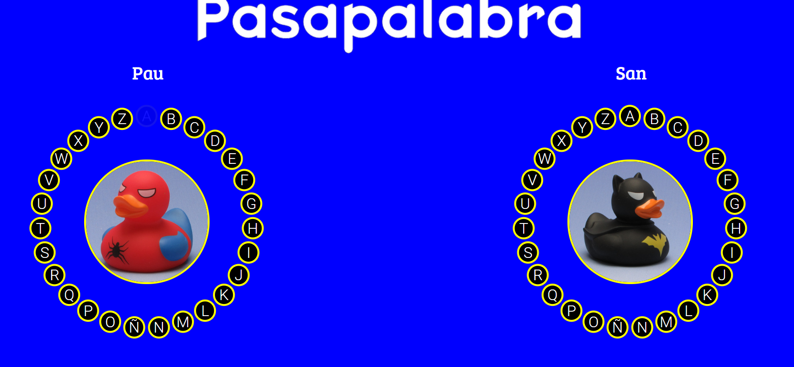

# Pasapalabra

Ejercicio perteneciente al curso preparatorio para el Bootcamp de Skylabs

Editado con HTML, CSS y Javascript

Para 2 jugadores simultáneos.

## Instrucciones/Modo de uso
- Hacer click en empezar
- Agregar nombre primer jugador
- Agregar nombre segundo jugador
- Responder en a las preguntas en el apartado indicado y hacer click en el botón ok
- Una vez finalizado el juego aparecerá la puntuación de los jugadores
- Para volver a iniciar el juego, hacer click en el botón Reiniciar, en la parte inferior derecha de la panatalla

 

