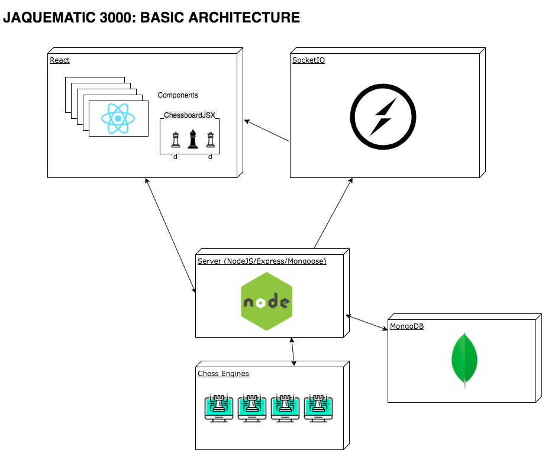

# Jaquematic 3000

## Intro

Jaquematic 3000 is an online chess application which was developed as the final project for the Skylab Academy full-stack 'bootcamp'.  It allows an unlimited number of users to play multiple games with each other.  Each user may play with an unlimited number of other users, one game for each pair at a time.  Players may play simultaneously, with moves being updated 'live', or they may play at their convenience, since moves are stored so that they are ready whenever a player logs in.

## Functional description

Jaquematic 3000 allows the chess afficionado to play an unlimited number of chess matches with other online users.  The user searches for other users from within the application and invites one or more to a chess match.  The invited user can accept or reject the invitation.  If the invitation is accepted, the two users start a game -- in this iteration of the application the inviting user plays white.  

Once playing, the players take turns.  Players may play simulataneously, with moves being updated 'live', or may login and play when they desire. Moves are checked for legality, and the user is alerted when they are in check.  The application checks for checkmate, stalemate, 3-repetition draw, lack of sufficient material, etc on each move, and if any of these situations occur the game ends, at which point the players are notified and the game is removed.  This iteration of the application does not permit the game to be reviewed once it has ended, neither may a player resign once a game has started.

## Technical description

The application is a web application that is meant to run within a browser environment. It consists of a ReactJS frontend that connects to with an API that runs on NodeJS.  The API uses ExpressJS to route requests and uses Mongoose to interface with a MongoDB store. The application uses the npm packages Chessboardjsx to handle the chessboard itself and Chess.js for the game engine to convert moves to FEN syntax and to handle rule-checking. 

The application is written in Javascript and takes advantage of ES6 and ESNext Javascript features.

User data is persistent across page reloads, as local data is stored in the user's SessionStorage.  

Styling is handled via SCSS and the application is mobile friendly.

Tests are written in Mocha/Chai.

## Data Models

## Basic Architecture

## Making A Move: sample communication flow

