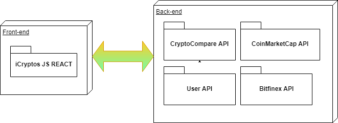
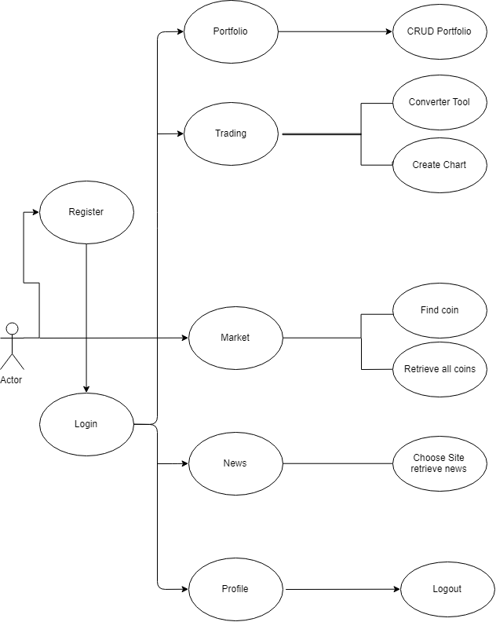
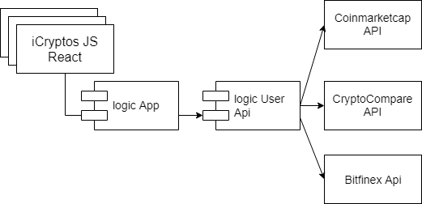

## Introduction

This application lets you be informed of the cryptocurrency market, have tools for trading and have an online portfolio with your transactions.

It was developed as a full-stack project for the Skylab Coders bootcamp (Barcelona, 2018). The objective was to apply the following technologies in a real life application:

- HTML 5
- CSS 3
- Bootstrap & Reactstrap
- Javascript (ES6)
- React
- React Router
- MongoDB, mongoose
- NodeJs, Express.
- APIs (4)
- TDD Mocha and Chai.
- NPM modules.

### Block diagram

The front end of the application was built using React. The back end wit Node, and is connected to 4 APIs in order to manage the users data (Users API), retrieve the market cap stats (CoinMarketCap API), create a trading chart ( Bitfinex API / Cryptowatch), and find the news (CryptoCompare API).

### Activity diagram

We have four principal activities: Create a portfolio. Use trading tools. Retrieve all crypto market stats and retrieve news from differents websites. 

### Components Diagram

Our application has some react components, the business logic connect to User api and it connects with the others three APIs that we use: Coinmarketcap API, CryptoCompare API and Bitfinex API.

