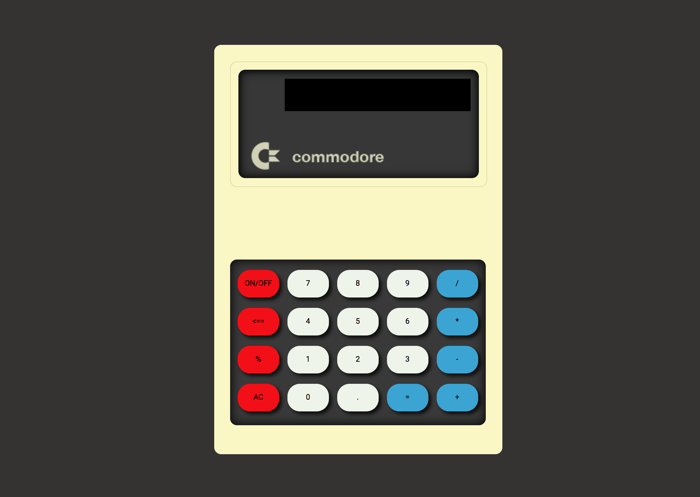

#Calculadora
Es un proyecto de código Javascript que emula el funcionamiento de una calculadora básica. Dispone de una pequeña interfaz creada en Html5 y CSS3.



-La calculadora posee un botón de encendido y apagado.
-Es capaz de realizar sumas, restas, multiplicaciones y divisiones.
-Mantiene el valor total en pantalla por si se quiere reutulizar.
-Puede limpiar la memoria.

Se puede utilizar pulsando sobre el siguiente mensaje.

```sh
$open index.html
```
